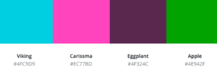

# Koffee & Kettlebells 

 

[View the live website here](https://mishsmelle.github.io/koffee-and-kettlebells/index.html)

The website was created for educational purposes only. The assignment was to build a gym website in HTML/CSS format that is user friendly, visually appealing and meets the gym owners goals of attracting and retaining members. This website features a gallery showcasing the best of the gym’s classes and facilities, a downloadable pdf menu for the on-site coffeehouse,  clear and concise information on classes, contact information and newsletter sign up option. 

## User Experience (UX)

**Site owner's goal:**

The gym is interested in attracting and retaining members. 

In the pre-production phase of this project I researched a number of similar upscale gyms for inspiration. I referenced an online survey published by [Glofox](https://www.glofox.com/blog/10-gym-membership-statistics-you-need-to-know/#:~:text=In%202019%2C%20more%20than%2062.5,at%20least%20twice%20a%20week). to build a prospective client identity and  focus for the site. From this survey I learned that some of the top reasons for quitting a gym are: 

* losing motivation
* feeling out of place
* not seeing results quick enough.

So when addressing my clients goal of retaining members, I chose to focus on the social aspects of the gym, highlighting the regular meetups, including images from the coffeehouse and showcasing the gym’s commitment to creating a gym that is more of a community.  

I felt this approach would simultaneously address the client’s goal of increasing new membership as “Gen Z and Millennials are a group of consumers who are willing to pay a premium price for health-related services. They want connectivity, community, and an innovative approach to wellness.” Glofox survey, 2021. 

**External user’s goal:**

According to [Noobgains.com](https://noobgains.com/gym-membership-statistics/) The average gym goer is 40 years old and can be equally male or female. 40% of all gym goers prefer to attend a class and 10% of all gym goers live with someone they met at the gym. Based on these statistics, the website focused on images that showed younger people enjoying the social aspects of the gym, information on the community spirit upheld by the gym and getting this information across as clearly as possible. The average user will spend [62 seconds](https://www.klipfolio.com/metrics/marketing/average-time-on-page#:~:text=What%20is%20a%20good%20Average,across%20industries%20is%2062%20seconds.) on a website’s homepage so all the information needs to be where the user would expect to find it. 

## User stories
**First Time Visitor Goals**
* “ I want a gym website with a clear purpose and to understand the gym owners goals and what the staff are like.”
* “I want to be able to find out when the next class is on without scrolling through lots of pages.” 
* “I want to be able to find out about plans available and sign up easily.” 
* “I want to see what the gym looks like to get a better idea of the experience and be able to see what their social media pages are like too.”  

**Returning Visitor Goals**
* “After seeing what the gym has to offer I now want to see the membership plans and sign up.” 
“I’ve been to the gym a couple of times but with the current health restrictions in place I want to know what the gym has to offer while they are closed.” 
“I want to meet more people in the gym and would like to know what events the gym has organised.” 
**Frequent User Goals**
* “I go to the gym all the time but feel I’m missing out on events. I’d like to sign up for a newsletter to stay informed.” 
* “I want to see what is on this week at the gym.” 
* “I want to email the gym to discuss my membership and need to find their contact info.” 
* “I love the coffee at The Koffeehouse and want to see if there is anything new on the menu.” 

## Design

### Colour Scheme ###

The colour palette was chosen to be fun, energetic and motivating. I primarily used a dark background with white text to appeal to our younger, new customers. White text on a darker background is considered more [“elite”, “creative” and “modern”](https://undsgn.com/website-dark-backgrounds/).  Except for section 2, “Who we are” as blocks of paragraph text are easier to read black on white. The main background colour chosen is #2E377F

For hyperlinks, headings and any other use of highlighting text, I used a colour palette from the hero image: 

### Typography ###

The font chosen for this website was Lato from Google Fonts. Lato is one of the most unique and interesting san-serif fonts. 
(https://www.forbes.com/sites/allbusiness/2014/03/06/10-best-sans-serif-web-fonts-from-google-fonts-library/) It has an interesting tone without being distracting or hard to read, perfect for the client’s desired corporate tone. 

### Imagery ###

The stock images were all chosen to compliment each other and to add consistency to the website. They focus on the social aspect of the gym including the coffeehouse and present an ideal body type that users will associate with this gym. 

### Wireframes ###

Home Page Wireframe - [View](assets/images/desktop-wireframe.png)

Mobile Wireframe - [View](assets/images/mobile_wireframe.png)

Online Classes Page Wireframe - [View](assets/images/onlineclasses-wireframe.png)

**Features**

The header features on each page and includes a responsive navigation bar with a drop down menu for the available online classes. The footer also features on each page and includes contact and location details, copyright information, social links with icons and a newsletter signup box. 
The home page features a hero image with animation and a bootstrap grid for section 2 and 3. Online Classes features a gallery of images using a carousel and Koffeehouse features a downloadable PDF menu. 

**Technologies Used***

* This project uses HTML and CSS programming languages.

* Gitpod
* BootstrapCDN
The project uses Bootstrap4 to simplify the structure of the website and make the website responsive easily. 

* The project also uses BootstrapCDN to provide icons from FontAwesome. 

* Google Fonts

* The project uses  a Lato font from Google fonts.

## Testing

[HTML Validator](https://validator.w3.org/)   
 

[CSS Validator](https://jigsaw.w3.org/css-validator/)

[Chrome DevTools](https://developers.google.com/web/tools/chrome-devtools/)

[Mobile - Friendly Test](https://search.google.com/test/mobile-friendly)

[Lighthouse](https://developers.google.com/web/tools/lighthouse) - was used to improve the quality of the website.

### Testing User Stories from User Experience (UX) Section ###

### First Time Visitor Goals ###

*“ I want a gym website with a clear purpose and to understand the gym owners goals and what the staff are like.”*

When the website loads the user will be greeted with a clear and concise navigation to show the user what the website has to offer.  The gym name is large enough to grab the users attention without distracting from the overall experience. The hero image immediately conveys the gym’s tone, fun, energetic and professional. 

Underneath the hero image the user can learn more about the gym’s goals and what the staff are like.

*“I want to see what the gym looks like to get a better idea of the experience.”*

The website uses strong and consistent imagery across the site. On each of the “Online Classes” pages, the user will see a slideshow gallery of images with an easy to use left and right click functionality. There is also an indicator on the bottom center of the images to display the current page, give the user to select a particular image to return to and to show how many images are in the gallery so the user can decide how many the want to see. 

**Returning Visitor Goals** 

*“After seeing what the gym has to offer I now want to see the membership plans and sign up.”*

The main homepage navigation has a ‘membership’ tab. When the user opens this page they will see three separate boxes with the three plans available, these were made white with dark text so the blocks of text would be easier to read. The more important text, i.e, the plan name and the cost per month, were made larger and therefore stand-out more. 
Underneath this is the form section where the user can easily click on the plan name they wish to join, enter their name and email and submit. 

*“I’ve been to the gym a couple of times but with the current health restrictions in place I want to know what the gym has to offer while they are closed.”*

The main homepage navigation has an ‘Online Classes’ tab. Here the user will have the option of choosing their class from a drop-down menu. When the page opens they will see details of the class and information on how to join one of the online classes during the health restrictions. 

*“I want to email the gym to discuss my specific membership needs and see if it is the right fit for me, I need to find their contact info.”*

The footer, which appears on all pages across the site for ease of use and has a limited amount of text so each element is clear, includes the gym’s contact information. Furthermore the email address is linked so the user can click on this and be immediately redirected to their mail server with the email address preloaded. 

**Frequent User Goals**

*“I go to the gym all the time but feel I’m missing out on events. I’d like to sign up for a newsletter to stay informed.”*

The frequent user will already be familiar with the website layout and will easily be able to navigate to the site footer. Here, there is a newsletter sign up option with a clear submit button so the user can join with ease. 

*“I want to be able to find out when the next class is on without scrolling through lots of pages.”*

The site has been designed to be as intuitive as possible. For our returning visitors who are already familiar with the gym, this week’s events are presented with strong, appealing imagery on the homepage with a rollover function to display the class information, thereby reducing the amount of clicks the users needs to make to find out the info and not overwhelming the homepage with text. 

*“I love the coffee at The Koffeehouse and want to see if there is anything new on the menu.”*

For gym users who also frequent The Koffeehouse there is a page accessible from the main navigation (viewable on each page) for the Koffeehouse where the user can view the menu but also has the option of downloading a pdf version to keep handy. 

## Learnings

* From this project I learned some valuable lessons including commenting out the CSS file (not just html) as you go is hugely important. 
* I would have saved a lot of time and bother if I had been making each element responsive as I went instead of building the website and then going back and making it responsive. 
* I will keep a readme file open in future and update as I go along instead of trying to resource references and details after the project is finished. 
* I will write my user stories at the beginning of the project. I found this hugely useful when testing the efficiency of my site but felt if I had more time I would have changed elements to reflect the user needs. In future I will have these set out and build as I go.

## Deployment
This project was developed using Gitpod, committed to git and pushed to GitHub using the terminal commands. 

To deploy this page to GitHub Pages from its GitHub repository, the following steps were taken:
* Log into GitHub.
* From the list of repositories on the screen, select Mishsmelle/koffee-and-kettlebells.
* From the menu items near the top of the page, select Settings.
* Scroll down to the GitHub Pages section.
Under Source click the drop-down menu labelled None and select Master Branch
* On selecting Master Branch the page is automatically refreshed, the website is now deployed.
* Scroll back down to the GitHub Pages section to retrieve the link to the deployed website.

### How to run this project locally ###
To clone this project: 

* Install the Gitpod Browser Extentions for Chrome
* After installation, restart the browser
* Log into Gitpod with your gitpod account.
* Navigate to the Project GitHub repository
* Click the green "Gitpod" button in the top right corner of the repository
* This will trigger a new Gitpod workspace to be created from the code in github where you can work locally.

To work on the project code within a local IDE such as VSCode, Pycharm etc:
* Open my github repository: Project GitHub repository.
* Click **"Clone or download".**
* copy the clone URL for the repository with the **https**. 
* Open your local IDE terminal. 
* Change the current directory to where you want the cloned directory to be made.
* Type git clone, and then paste the URL you copied in Step 3.
* git clone https://github.com/mishsmelle/koffee-and-kettlebells
* Press Enter. Your local clone will be created.

## Credits

### Content ###
The content was written by myself, Michelle O’Connor. 

### Media ###
All the photos used in this site were obtained from free stock website pexels.com and edited using canva.com
Logo was designed by myself, Michelle O’Connor using templates on canva.com

### Code ###
*Header code credit: fellow Code Institute student, Jacqueline Kraus (jacqueline-kraus.github.io) and adapted to suit my own website style. 
* Section 1, “Hero Image” code credit: Code institute “Love Running” project. 
* Section 2, “Who we are” code credit: fellow Code Institute student, Alex Andruvalentin (https://alexandruvalentin.github.io/) and adapted to suit my own website style.
* Section 3 “ Class times” code credit: https://bootstrapbay.com/blog/day-5-bootstrap-4-images-tutorial-and-examples/#bootstrap-4-image-overlays  and adapted to suit my own website style. 
* Footer code credit:fellow Code Institute student, Alex Andruvalentin (https://alexandruvalentin.github.io/) and adapted to suit my own website style.

## Acknowledgements

I researched various gym websites such as nrg.ie, westwood.ie, flyefit.ie and dailyburn.com  for inspiration before beginning my project. 

My mentor Gerard McBride for his help and support throughout this project. 

*** Disclaimer ***

The content of this website are for educational purposes only.
 
 
 
 

